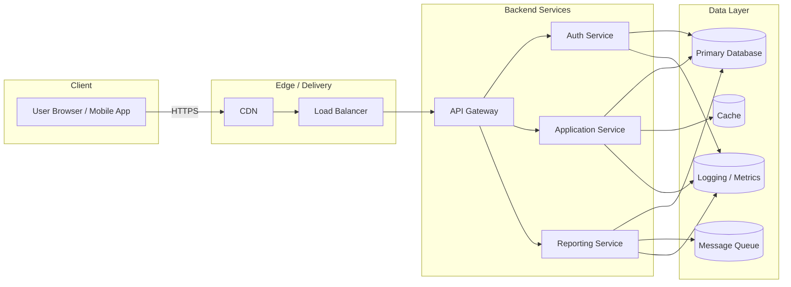

# System Architecture Overview

This document provides a high-level overview of the system architecture, including the main components and how they interact.

## Architecture Diagram

## Component Descriptions

The **Client** group represents end users accessing the system from web or mobile applications over HTTPS.  

The **Edge / Delivery** group includes the CDN for caching static assets and the load balancer for distributing incoming traffic across backend instances.  

The **Backend Services** group contains the API Gateway as the single entry point for client requests, which routes calls to internal microservices such as authentication, core application logic, and reporting.  

The **Data Layer** includes the main transactional database, a cache for frequently accessed data, a message queue for asynchronous processing, and logging/metrics infrastructure for observability.